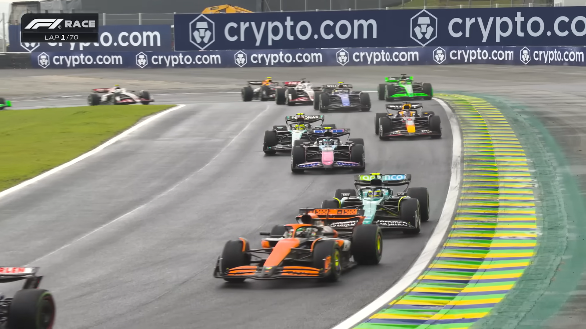
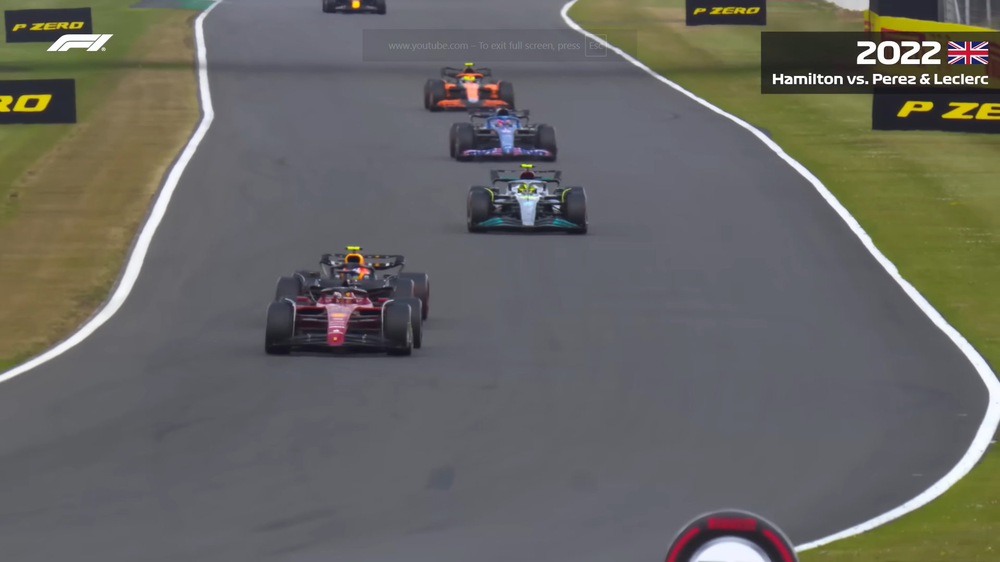
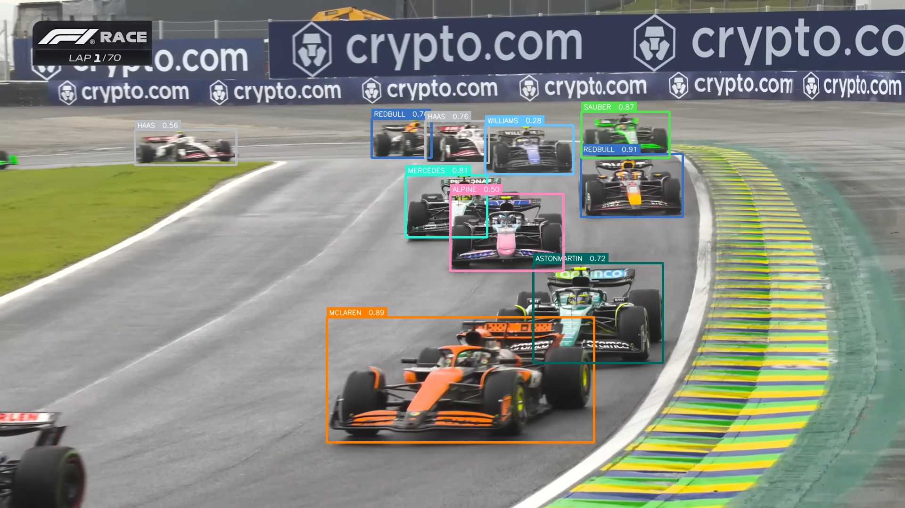
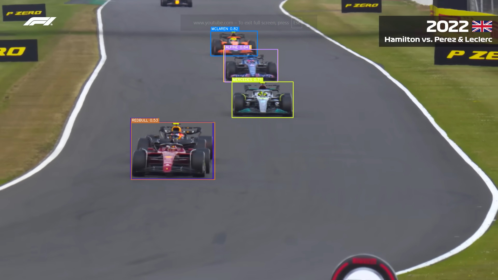
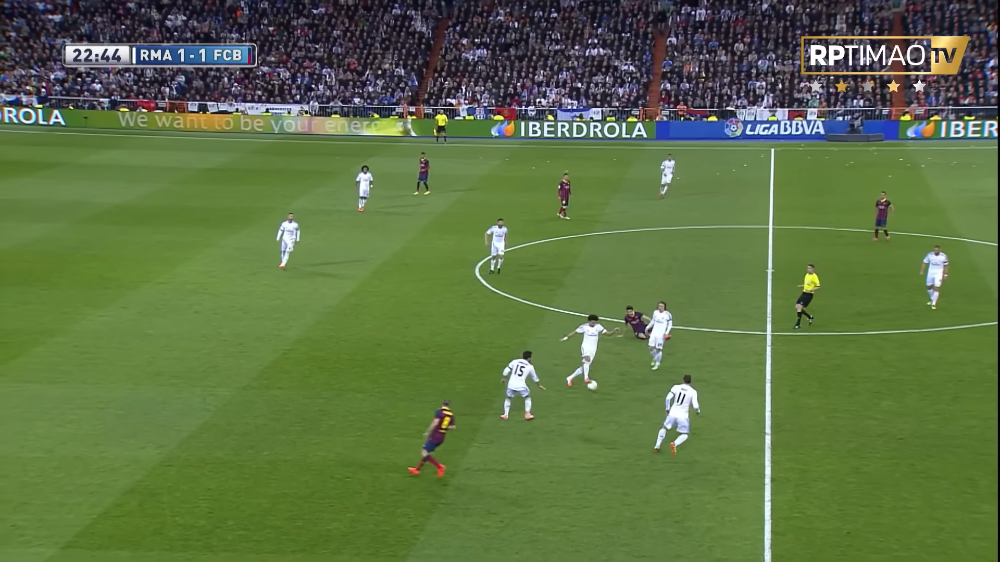
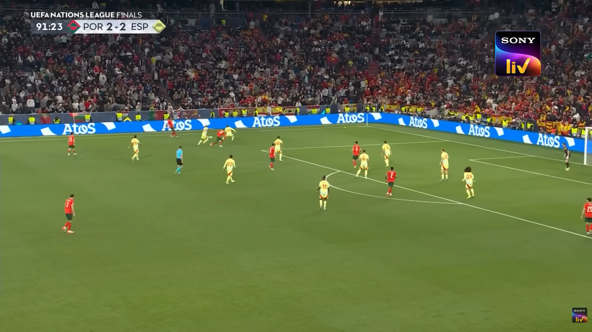
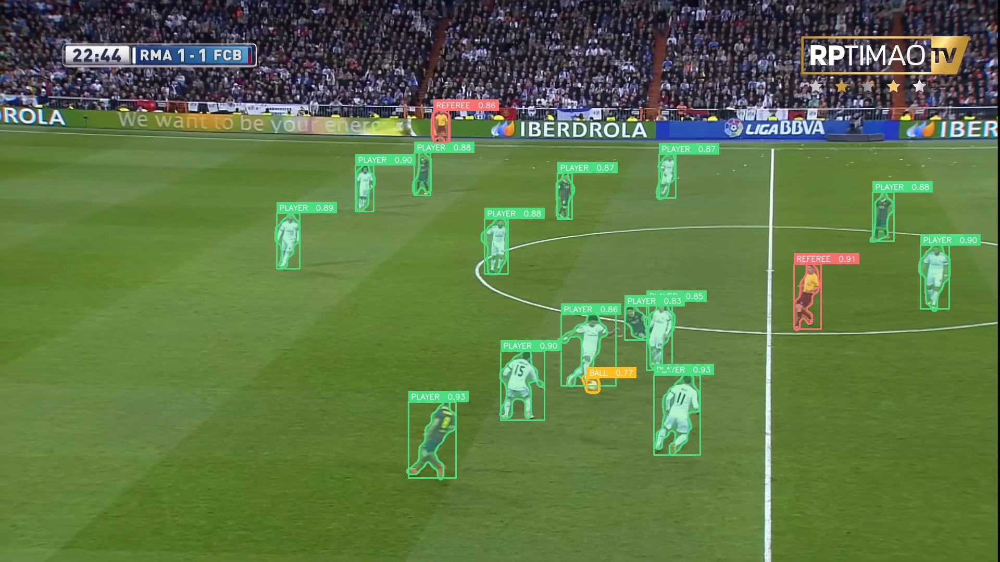
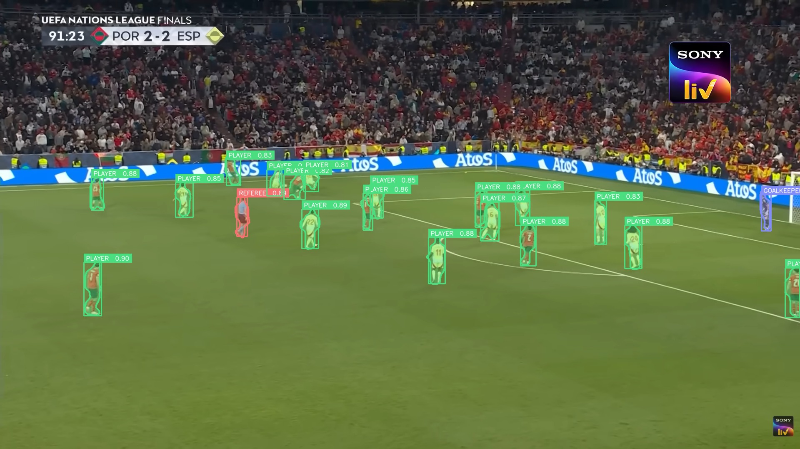

# 🏎️⚽ SportVision AI — OpenCV Sports Analysis

[](https://open-cv-sports-analysis.vercel.app/)
[](https://www.python.org/)
[](https://fastapi.tiangolo.com/)
[](https://nextjs.org/)
[](https://opencv.org/)

A full-stack **sports computer vision system** built around a strong **OpenCV-first pipeline**, powered by **FastAPI**, and visualized using **Next.js + React**.

The project focuses on converting raw sports images or frames into **clean, annotated, and structured visual outputs** using efficient preprocessing, ONNX inference, and polished frontend presentation.

---

## 🚀 Live Demo

Visit the deployed application here:

**https://open-cv-sports-analysis.vercel.app/**

---

## 📌 Overview

SportVision AI processes sports media through a carefully engineered pipeline:

- OpenCV-based preprocessing
- ONNX model inference
- Postprocessing and rendering
- Frontend visualization

It supports:

- ⚽ **Football** → segmentation for players, ball, referee, and goalkeeper
- 🏎️ **Formula 1** → constructor-level detection across broadcast footage

---

## ✨ Key Features

### 🔍 OpenCV Pipeline (Core Focus)

- Image decoding using OpenCV
- Letterbox resizing without distortion
- BGR → RGB conversion
- Normalization to `[0, 1]`
- Tensor formatting in `NCHW`
- Postprocessing of raw ONNX outputs
- Class-wise Non-Maximum Suppression
- Bounding box rendering
- Segmentation mask overlays
- Base64 encoding for frontend delivery

### ⚽ Football Segmentation

- Ball
- Goalkeeper
- Player
- Referee

### 🏎️ Formula 1 Detection

- Alpine
- Aston Martin
- Ferrari
- Haas
- McLaren
- Mercedes
- Racing Bulls
- Red Bull
- Sauber
- Williams

### 🌐 Full-Stack Support

- FastAPI backend for inference APIs
- Next.js + React frontend for visualization
- Clean upload → analyze → results workflow
- Structured detections and class counts
- Responsive dashboard-style UI

---

## 📸 Results & Testing

### Formula 1 Detection

| | |
|---|---|
|  |  |
|  |  |

### Football Segmentation

| | |
|---|---|
|  |  |
|  |  |

---

## 🧠 System Architecture

```text
User Upload (Image / Frame)
        ↓
Next.js Frontend
        ↓
FastAPI Backend
        ↓
OpenCV Preprocessing
        ↓
ONNX Model Inference
        ↓
OpenCV Postprocessing + Rendering
        ↓
Annotated Result + Metadata
        ↓
Frontend Dashboard
```

---

## 🔬 OpenCV Pipeline Deep Dive

### 1) Preprocessing

OpenCV is used to prepare the input frame before inference:

- Decode image bytes
- Convert BGR → RGB
- Resize using letterbox
- Pad to a square canvas
- Normalize pixel values
- Convert to `NCHW` format

### 2) Postprocessing

The raw ONNX tensor is converted into useful detections:

- Squeeze and orient prediction tensors correctly
- Split box coordinates from class scores
- Handle objectness if present
- Filter low-confidence predictions
- Apply class-wise NMS
- Map detections back to original image size

### 3) Rendering

OpenCV is used again to build the final output:

- Draw bounding boxes
- Add class labels and confidence values
- Blend football segmentation masks
- Preserve sharp overlays for visualization
- Return clean annotated output to the frontend

---

## 🧪 Model Training Notebook

The included `sports-cv.ipynb` documents the training workflow for both sports domains.

### Football Model

- YOLOv11x-seg
- Roboflow dataset
- Instance segmentation training
- Export to ONNX

### Formula 1 Model

- YOLOv11l
- Custom F1 dataset
- Constructor-level detection
- Export to ONNX

### Export Workflow

- Final checkpoints exported in ONNX format
- Optimized for backend inference
- Suitable for CPU deployment and production use

---

## 📊 Model Performance & Results

The models were trained using Ultralytics YOLOv11 architecture with optimized hyperparameters and augmentation strategies. Below are the final evaluation metrics obtained on the validation set.

---

### 🏎️ Formula 1 Detection (Object Detection)

| Metric         | Value |
|---------------|------|
| Precision     | 0.884 |
| Recall        | 0.884 |
| mAP@50        | 0.935 |
| mAP@50-95     | 0.773 |

**Observations:**
- Strong detection performance across all 10 constructor classes  
- High mAP@50 indicates accurate localization and classification  
- Balanced precision and recall → stable predictions  
- Slight drop in mAP@50-95 suggests difficulty with small/distant cars  

---

### ⚽ Football Segmentation (Instance Segmentation)

#### 🔹 Bounding Box Performance

| Metric         | Value |
|---------------|------|
| Precision     | 0.959 |
| Recall        | 0.920 |
| mAP@50        | 0.947 |
| mAP@50-95     | 0.688 |

#### 🔹 Segmentation Mask Performance

| Metric         | Value |
|---------------|------|
| Precision     | 0.835 |
| Recall        | 0.803 |
| mAP@50        | 0.802 |
| mAP@50-95     | 0.456 |

**Observations:**
- Excellent bounding box detection performance (~0.95 mAP@50)  
- Segmentation performs well for large objects (players)  
- Lower mask mAP@50-95 reflects challenges in fine boundary precision  
- Ball detection remains the most difficult due to scale and motion  

---

### 🧠 Key Insights

- OpenCV preprocessing significantly stabilizes inference outputs  
- Detection performance is highly robust across varied race conditions  
- Segmentation accuracy is strong but sensitive to object size  
- mAP@50 vs mAP@50-95 gap highlights localization precision challenges  
- Models generalize well to unseen broadcast footage  

---

## 🏗️ Repository Structure

```text
openCV-Sports-Analysis/
├── Backend-Sports-Analysis/
│   ├── app/
│   │   ├── core/
│   │   ├── models/
│   │   ├── routers/
│   │   └── main.py
│   ├── tests/
│   ├── Dockerfile
│   └── requirements.txt
├── frontend-Sports-Analysis/
│   ├── src/
│   │   ├── app/
│   │   ├── components/
│   │   ├── lib/
│   │   └── types/
│   ├── package.json
│   └── tailwind.config.ts
├── sports-cv.ipynb
└── assets/
```

---

## ⚙️ Backend — FastAPI

The backend is responsible for loading ONNX sessions and serving inference results through a clean API.

### Backend Features

- ONNX Runtime inference
- Football and F1 model support
- CPU / GPU fallback
- Structured JSON responses
- Annotated image generation
- FastAPI docs support

### API Endpoints

- `GET /health` → check model loading status
- `POST /analyze` → run analysis on uploaded media
- `GET /docs` → interactive Swagger UI

---

## 🎛️ Frontend — Next.js + React

The frontend is designed as a clean analysis interface for uploads and visual results.

### Main Frontend Components

- Upload zone
- Analysis engine
- Results panel
- Navbar / navigation
- Sport-specific pages for football and F1

### Frontend Features

- Drag and drop upload flow
- Inference feedback
- Result preview
- Class counts and overlays
- Clean responsive UI
- Tailwind + Framer Motion styling

---

## 🛠️ Setup

### Backend

```bash
cd Backend-Sports-Analysis
pip install -r requirements.txt
uvicorn app.main:app --reload
```

### Frontend

```bash
cd frontend-Sports-Analysis
npm install
npm run dev
```

---

## 🌍 Environment Variables

```env
FOOTBALL_MODEL_PATH=./models/football_production_core.onnx
F1_MODEL_PATH=./models/f1_production_core.onnx
CONF_THRESHOLD=0.25
IOU_THRESHOLD=0.45
NEXT_PUBLIC_API_URL=http://localhost:8000
```

---

## 🚀 Use Cases

- Sports analytics dashboards
- Football segmentation demos
- Formula 1 detection overlays
- Broadcast frame analysis
- AI + computer vision portfolio projects
- Full-stack ML deployment showcases

---

## 🔮 Future Improvements

- Multi-frame tracking
- Live video stream support
- Player/team analytics over time
- Heatmaps and zone analysis
- Better segmentation refinement
- Temporal smoothing for far-away objects

---

## 🙌 Acknowledgements

- OpenCV
- Ultralytics YOLO
- FastAPI
- Next.js
- React
- Roboflow
- ONNX Runtime

---

## 📜 License

MIT License
